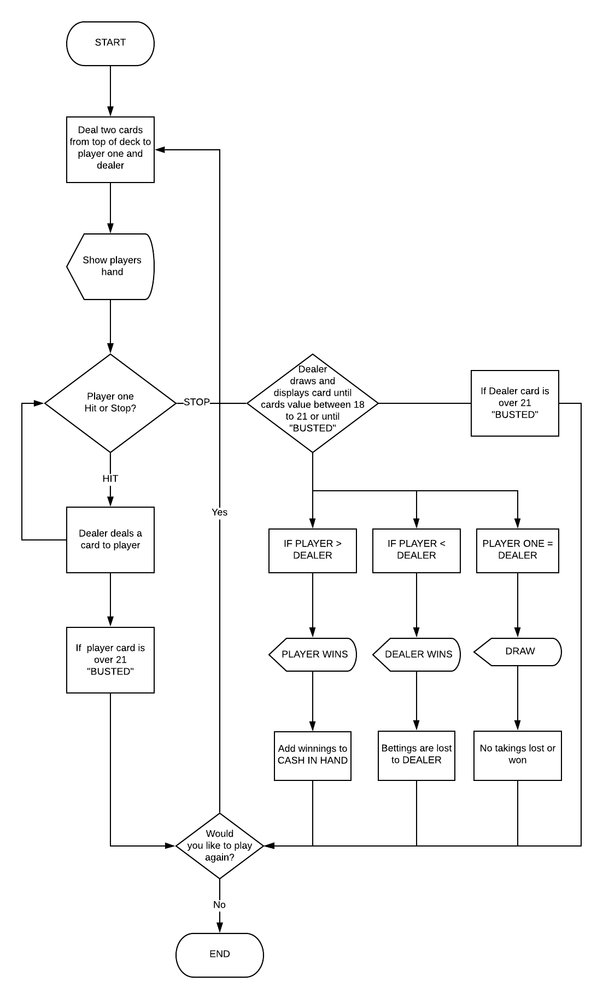

# 21 card game

# Purpose and Scope
This application was built to introduce a card game that can be played for all ages and was made especially for those who'd like to work on addition skills and have fun at the same time. The 21 Card Game provides many mathematical learning opportunities:

- Addition and subtraction
- Greater than or less than
- non mathematical skills like decision making for instance; whether to sit or call another card.

# Aim
The aim of the game is to get 21 or as close to as possible but also avoiding anything higher than 21.

Each card has a value equivalent to the card number except for J, Q and K which has an equivalent value of 10.

The computer is programmed to act as the dealer.

If Player either has the upper hand over Dealer or Dealer busts, Player wins.

If Dealer either has the upper hand over Player or Player busts, Dealer wins.

If each Player and Dealer hands are equal the game will end in a tie. 

### There are some aspects of the game that are missing from the traditional game itself
For e.g. The game 21 normally allows as many players to join and play against the dealer.

However this application has limited it to only one user per game.

With the exception of the dealer the player will firstly receive two random cards from deck and dealer will later follow up right after player ends his or her turn. 

Therefore dealer will have no cards up on display thus player needs to decide whether to hit or stand without having any idea what the dealer cards are.

Depending on the user, the Ace card("A") can normally have a value of either 1 or 11, but for the simplicitiy of the game a fixed value was assigned to the variable, which in this case being the number 1.

# Features

### First feature 
The game is a money betting system. Player begins the game with an amount of cash in hand and is required to place a minimum betting in order to play. Inside the class Bank, instance variables of "cash on hand" and "betting" are created. An object called money is created and data inside the class is accessed using instance methods. After the end of the game, depending on the outcome, objects access and update the instance variable of "cash on hand".

### Second feature
If cash on hand reaches 0 or is less than the required betting the application will no longer go forth with the game and will deny the player to continue. The game will automatically close and user will be prompted to re-enter the game.

### Third feature
The game asks if the player would like to play the game again and will be looped back to the game if user enters "yes" when prompted. A while loop will allow this to work until player inputs "no" after the game has asked whether the use would like to continue or not. 

# Flowchart

